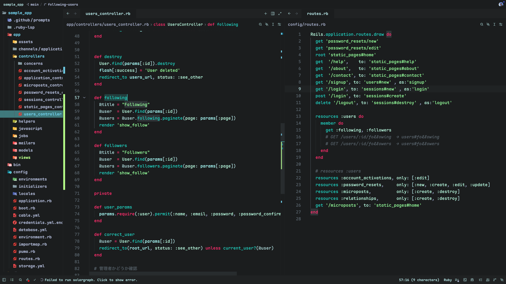

# Resonance with Hatsune Miku

A dark theme for [Zed](https://zed.dev) inspired by Hatsune Miku's iconic color palette — deep charcoal backgrounds with teal and cyan accents.



## Color Palette

| Role | Color |
| --- | --- |
| Editor background | |
| Sidebar / Panel background | |
| Cursor | |
| Foreground (text) | |
| Muted foreground | |
| Accent | /  |
| Keywords / Operators | |
| Strings | |
| Variables / Properties | |
| Types / Constants | |
| Numbers / Booleans | |
| Functions | |
| **Git Status** | |
| New file | |
| Modified file | |
| Deleted file | |
| Error | |

## Installation

### Via Zed Extension Marketplace

Search for **"Resonance with Hatsune Miku"** in Zed's extension browser (`cmd-shift-x`) and install it.

### Manual

Copy the theme JSON to Zed's themes directory, then select it with `cmd-k cmd-t`:

```sh
mkdir -p ~/.config/zed/themes
cp themes/resonance-with-hatsune-miku.json ~/.config/zed/themes/
```

### Dev Extension (for customization)

Use `zed: install dev extension` from the command palette and point it at this directory.

Or symlink for live editing:

```sh
ln -sf "$PWD/themes/resonance-with-hatsune-miku.json" \
       ~/.config/zed/themes/resonance-with-hatsune-miku.json
```

## Theme Attribute Reference

See [THEME_REFERENCE.md](./THEME_REFERENCE.md) for a full mapping of color keys to Zed UI elements.

## License

[MIT](./LICENSE)
