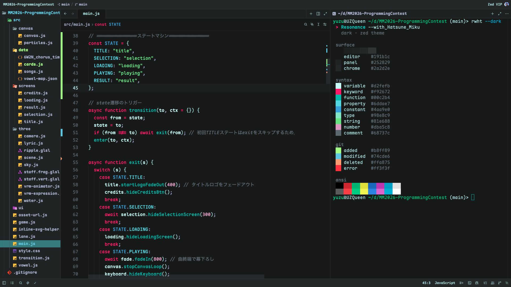
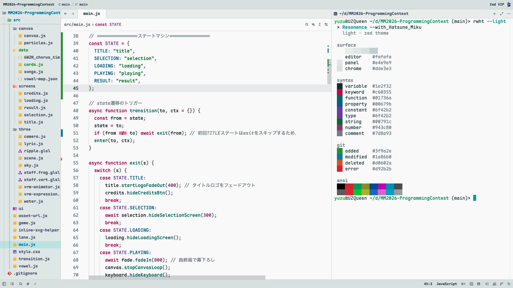

<h1 align="center">
  <picture>
    <source media="(prefers-color-scheme: dark)" srcset="./images/logo_dark.svg">
    <source media="(prefers-color-scheme: light)" srcset="./images/logo_light.svg">
    
  </picture>
</h1>

**Resonance with Hatsune Miku** is a [Zed](https://zed.dev) theme born from a simple wish: as a Miku fan, I want to stay with her even while I'm writing code.
Inspired by Hatsune Miku's color palette — her signature teal paired with vivid pink — it comes in both dark and light variants.

Beyond the colors themselves, every shade is tuned so the code you're reading stays in focus: syntax colors are arranged in three lightness tiers by importance, and the editor pane is set apart from the surrounding panels in even steps.

## Preview

### Dark



### Light



## Color Palette

| Dark | Light |
| --- | --- |
|  |  |

<details>
<summary>All colors as a table</summary>

| Role | Dark | Light |
| --- | --- | --- |
| Editor background |  |  |
| Side panel background |  |  |
| Title bar / Status bar |  |  |
| Cursor |  |  |
| Foreground (text) |  |  |
| Comments / Muted |  |  |
| Accent |  |  |
| Keywords / Operators |  |  |
| Strings |  |  |
| Variables |  |  |
| Properties |  |  |
| Constants |  |  |
| Types |  |  |
| Numbers / Booleans |  |  |
| Functions |  |  |
| **Git Status** | | |
| New file |  |  |
| Modified file |  |  |
| Deleted file |  |  |
| Error |  |  |

</details>

## Design

The palette was first picked by feel from Miku's colors, then refined with a few principles from visual perception.
All adjustments change only lightness and chroma, never hue, so the Miku palette stays intact.

- **Perceptual lightness (OKLCH)**: Colors are tuned in [OKLCH](https://oklch.com), a perceptually uniform color space, so that "same lightness" actually looks equally bright to the eye.
- **Three tiers by importance**:
  1. **Variables** — the identifiers you read most — get the highest contrast.
  2. **Syntax accents** (keywords, functions, properties, constants, types, strings, numbers) share one lightness band and are told apart by hue.
  3. **Punctuation and comments** step back so they don't compete with names.
- **Helmholtz–Kohlrausch effect**: Highly saturated colors look brighter than their measured lightness. The vivid pink keywords are therefore set lower in lightness so they sit in balance with the other accents instead of glaring.
- **Focus on the editor**: The editor pane is the calmest surface. Tab bar, side panels and title/status bar step away from it in equal lightness steps — darker in the light theme, lighter in the dark theme — so the code area naturally draws the eye.
- **Contrast**: Every token color in the palette meets WCAG AA (4.5:1) against the editor background. Comments are intentionally quieter (about 3.5:1).

## Installation

### From Zed

Open the extensions page (`cmd-shift-x`), search for **"Resonance with Hatsune Miku"** and install it.
You can also open [the extension page on zed.dev](https://zed.dev/extensions/resonance-with-hatsune-miku-theme) and install it from there, which launches Zed.

Then pick the theme with `cmd-k cmd-t`.

> [!NOTE]
> Version 1.0.0 (light variant and refreshed dark palette) is waiting for the extension store update.
> Until it is published, the store serves the previous version, which includes the dark theme only.

### Follow the System Appearance

Both **Resonance with Hatsune Miku** (dark) and **Resonance with Hatsune Miku Light** are included in the extension.
To switch automatically with your system appearance, set both themes in your Zed settings:

```json
{
  "theme": {
    "mode": "system",
    "light": "Resonance with Hatsune Miku Light",
    "dark": "Resonance with Hatsune Miku"
  }
}
```

## Customization

Clone this repository and try your changes in one of two ways:

- **Dev extension**: Click **Install Dev Extension** on Zed's extensions page (or run `zed: install dev extension` from the command palette) and select the cloned directory.
- **Symlink**: Link the theme file into Zed's themes directory. Zed reloads it whenever you save.

  ```sh
  mkdir -p ~/.config/zed/themes
  ln -sf "$PWD/themes/resonance-with-hatsune-miku.json" \
         ~/.config/zed/themes/resonance-with-hatsune-miku.json
  ```

See [THEME_REFERENCE.md](./THEME_REFERENCE.md) for a mapping of color keys to Zed UI elements.

## License

This theme is distributed under the [MIT License](./LICENSE).

This work depicts the character "初音ミク" (Hatsune Miku) of Crypton Future Media, Inc. based on the [Piapro Character License](https://piapro.jp/license/pcl/summary).
This is an unofficial fan work and is not affiliated with or endorsed by Crypton Future Media, Inc.
